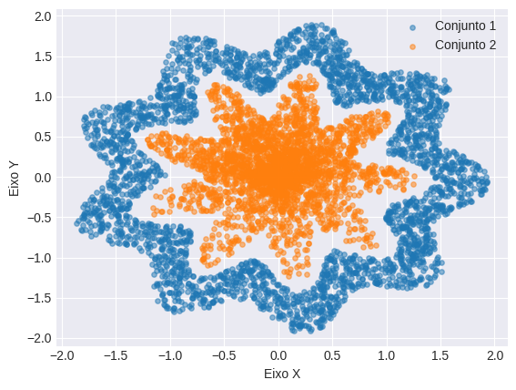

# Checkpoint 02 - Rede neural
**Nota recebida:** 10/10

Projeto desenvolvido para avaliação da disciplina Disruptive Architectures - IOT, IOB AND IA. O conteúdo que se segue nesse README foi escrito baseado no projeto e nas instruções do professor.

### Resumo

Foi-nos fornecido um algoritmo que gera, baseado no RM do aluno, duas listas com a intenção dos conjuntos de dados de cada um serem únicos. Adicionei a linha de código `np.random.seed(1)` para facilitar os testes fazendo o algoritmo se basear sempre na mesma seed para gerar os valores aleatórios. É importante ressaltar que, apesar da semente, os conjuntos gerados com meu RM continuam únicos. Também alterei o algoritmo para que não seja necessário usar meu RM mas os dados continuem o mesmo por motivos de segurança.

O objetivo do projeto se resume a criar um modelo de rede neural que consiga predizer a qual conjunto de dados um valor pertence. Naturalmente, percebi que o problema pode ser resolvido com uma predição binaria: pertence ou não pertence.

Abaixo o gráfico de dispersão envolvendo os dois conjuntos gerados:

## Instruções do professor

Além das instruções dentro do arquivo [`Arquivo_base.ipynb`](/adicionais/Arquivo_base.ipynb), foram dadas as seguintes instruções reescritas por mim de maneira mais sucinta:

- Avaliação **INDIVIDUAL**;
- **Objetivo:**
Avaliar conceitos sobre Aprendizado Profundo com Redes Neurais;
- **Descrição do Projeto:**
Implemente uma rede neural que seja capaz de classificar corretamente os dados;
- Comente sobre a decisão de cada parametro utilizado;
- **Serão avaliados:**
    - Estrutura do código;
    - Testes realizados;
    - Números de neurônios;
    - Número de camadas;
    - Algoritmo de adaptação;
    - Partâmetros do algoritmo de adaptação;
    - Função de ativação.
- Cuidado com a desonestidade intelectual (auto avaliação sincera no formulário; plágio; cola de trabalhos);
- O estudante deve:
    - implementar o projeto baseado na rubrica apresentada;
    - preencher o google forms de avaliação disponibilizado pelo professor;
    - subir o código em um repositório do github.
    
# Interpretações e considerações
**Esse tópico também consta no arquivo principal do projeto, o [`CheckPoint_Rede_neural.ipynb`](/CheckPoint_Rede_neural.ipynb).**

Aqui estão as perguntas que estruturei me baseando nos tópicos que serão avaliados pelo professor e também as perguntas do forms.

- **Estrutura do código:**
>Considero bem estruturado :D

  >Além da divisão por etapas, fiz uma função que permita rápidamente testar os meus modelos favoritos alterando o valor de variáveis no primeiro bloco de código de modelagem. Por praticidade, mantive uma maneira rápida de alterar o otimizador mesmo algumas configurações sendo bem inferiores.

- **Quais foram os testes realizados?**
>Priorizei a acurácia pois é a mais relevante para avaliar predições binárias e confiável quando se trata de dados bem proporcionais - tenho 3000 de um conjunto e 3000 de outro. Aproveitei para medir a precisão, o recall e o F1-Score que combina a precisão e o recall em um só.

  > Fiz também comparações dos resultados entre diferentes modelagens da rede neural envolvendo camadas, números de neurônios etc.

- **Qual a influência do número de neurônios? E do número de camadas?**
>Aparentemente, quanto mais neurônios, menor o custo-benefício. A Lei de Brooks se aplica aqui. Quanto mais recursos (neurônios) eu coloco, menores são os benefícios. O mesmo se aplica às camadas.

  >Por fim, escolhi como melhor resultado o menor modelo mesmo tendo resultados inferiores comparado com um maior número de camadas. A natureza do problema me permite abrir mão de 1-2% de ganho nos resultados em troca de mais eficiência, o que dá, usando meus dados como métrica, aproximadamnte 60-120 erros a mais. Se fosse um modelo que predita se alguém está doente, por exemplo, minha decisão seria inversa. Priorizar os melhores resultados mesmo com uma grande perda de eficiência seria muito melhor.

- **Qual a ifluência do algoritmo de adaptação? E dos parâmetros?**
>Escolhi o **Adam** como principal. Sabe-se que ele é adequado para problemas com grande volume de dados - no meu caso, 6000 - e lida bem com predições binárias. O algoritmo **Nadam** com o modelo longo foi o que teve melhor resultado, porém não sei exatamente o que ele faz e, conforme explicado no tópico acima, priorizei a performance, o que ele não manteve com o modelo curto que fiz.

  >Decidi que não há necessidade de usar o Dropout pois a diferença entre treino e teste foram muito baixas. Acho muito difícil estar gerando overfitting. Testei o BatchNormalization em conjunto com os testes de várias camadas onde ele é mais eficiente e não percebi grandes mudanças.

- **Qual a influência da função de ativação?**
>Escolhi a **relu** para as camadas intermediárias. Sua eficiência ajuda para meu problema com uma relevante quantia de dados além de promover a não-linearidade, o que condiz com os dados que tenho.

  >Para a camada de saída, utilizei o **sigmoid**. Ele é útil porque pode produzir uma saída que indica a probabilidade de pertencer à classe `1`, o que funciona muito bem para classificações binárias já que, se tiver pouca probabilidade de pertencer a classe `1`, então pertence a `0`.

## Autor
Feito por [@juniorcavicchioli](https://github.com/juniorcavicchioli?tab=repositories). Entre em contato!

LinkedIn: [Adilson Roberto Cavicchioli Junior](https://www.linkedin.com/in/adilson-roberto-cavicchioli-junior-6816b7192?lipi=urn%3Ali%3Apage%3Ad_flagship3_profile_view_base_contact_details%3BIpMh5bVEQOi82%2FRHJ6oxkg%3D%3D)  
Email: [cavicchioli.adilson@gmail.com](mailto:cavicchioli.adilson@gmail.com)
